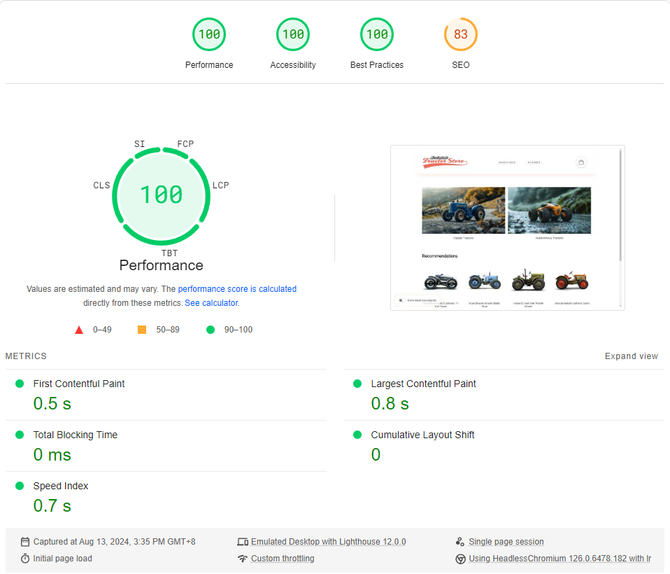

# The Tractor Store - React & Module Federation

A micro frontends sample implementation of [The Tractor Store](https://micro-frontends.org/tractor-store/) built with React, Webpack and Module Federation. It's based on the [Blueprint](https://github.com/neuland/tractor-store-blueprint).

**Live Demo:** [https://tractor-store-react.pages.dev/](https://tractor-store-react.pages.dev/)

## About This Implementation

### Technologies

List of techniques used in this implementation.

| Aspect                     | Solution                                  |
| -------------------------- | ----------------------------------------- |
| 🛠️ Frameworks, Libraries   | [React], [React-Router], [Webpack]        |
| 📝 Rendering               | SPA                                       |
| 🐚 Application Shell       | None                                      |
| 🧩 Client-Side Integration | Module Federation                         |
| 🧩 Server-Side Integration | None                                      |
| 📣 Communication           | Custom Events, HTML Attributes            |
| 🗺️ Navigation              | SPA, One MF per Team                      |
| 🎨 Styling                 | Self-Contained CSS (No Global Styles)     |
| 🍱 Design System           | None                                      |
| 🔮 Discovery               | None                                      |
| 🚚 Deployment              | Static Page(Cloudflare Pages)             |
| 👩‍💻 Local Development       | [Webpack]                                 |

[React]: https://react.dev/
[React-Router]: https://reactrouter.com/en/main
[Webpack]: https://webpack.js.org/

### Limitations

This implementation is deliberately kept simple to focus on the micro frontends aspects. URLs are hardcoded, components could be more DRY and no linting, testing or type-safety is implemented. In a real-world scenario, these aspects should be addressed properly.

### Performance



## How to run locally

Clone this repository and use `lerna` to bootstrap the mono repo. Run the following commands:

```bash
npm install
```

Start the development server:

```bash
npm run dev
```

Open http://localhost:3000 in your browser to see the integrated application.

Alternatively, you can use the `npm run serve` command to serve the built application locally.

## About The Authors

[Kent Li](https://kentl.dev/) is a software developer in China. 

## License

This sample code is released using the MIT license. For more information, see the [LICENSE](LICENSE) file.
